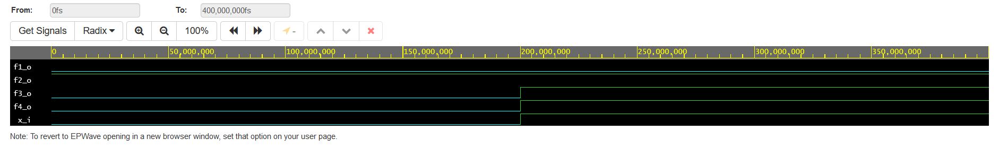
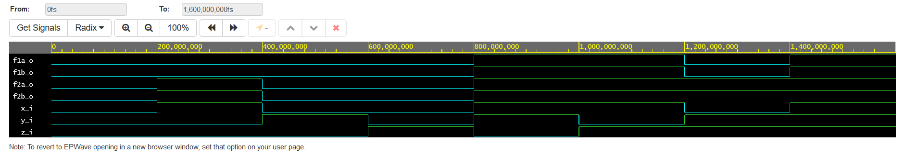
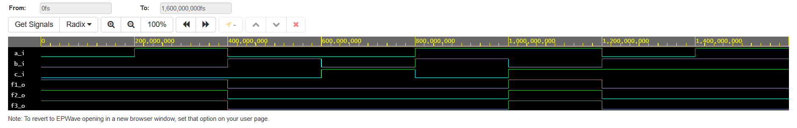

# Vypracovanie PC_1

## 1. Boolean Postulates:

https://www.edaplayground.com/x/bG6s
```VHDL
--Boolean Postulates
library IEEE;
use IEEE.std_logic_1164.all;

entity gates is
	port(
    	x_i : in std_logic;
        f1_o : out std_logic;
        f2_o : out std_logic;
        f3_o : out std_logic;
        f4_o : out std_logic
    );	
end entity gates;

architecture dataflow of gates is
begin
    f1_o <= x_i and (not x_i);
    f2_o <= x_i or (not x_i);
    f3_o <= x_i or x_i or x_i;
    f4_o <= x_i and x_i and x_i;
    
end architecture dataflow;
```


## 2. Distributive Laws:

https://www.edaplayground.com/x/RY5v
```VHDL
--Distributive Laws
library IEEE;
use IEEE.std_logic_1164.all;

entity gates is
	port(
    	x_i : in std_logic;
        y_i : in std_logic;
        z_i : in std_logic;
        f1a_o : out std_logic;
        f1b_o : out std_logic;
        f2a_o : out std_logic;
        f2b_o : out std_logic
    );	
end entity gates;

architecture dataflow of gates is
begin
    f1a_o <= (x_i and y_i) or (x_i and z_i);
    f1b_o <= x_i and (y_i or z_i);
    f2a_o <= (x_i or y_i) and (x_i or z_i);
    f2b_o <= x_i or (y_i and z_i);
    
end architecture dataflow;
```


## 3. DeMorgan's Laws

https://www.edaplayground.com/x/MDrq
```VHDL
--DeMorgan's Laws
library IEEE;
use IEEE.std_logic_1164.all;

entity gates is
	port(
    	a_i : in std_logic;
        b_i : in std_logic;
        c_i : in std_logic;
        f1_o : out std_logic;
        f2_o : out std_logic;
        f3_o : out std_logic
    );	
end entity gates;

architecture dataflow of gates is
begin
	f1_o <= ((not b_i) and a_i) or ((not c_i) and (not b_i));
    f2_o <= not ((not ((not b_i) and a_i)) and (not ((not c_i) and (not b_i))));
    f3_o <= (not (b_i or (not a_i))) or (not (c_i or b_i));
    
end architecture dataflow;
```

