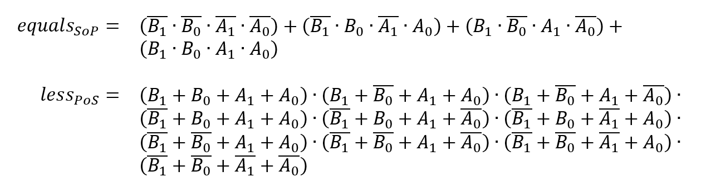
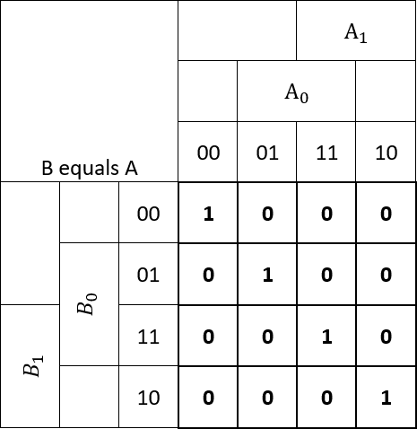
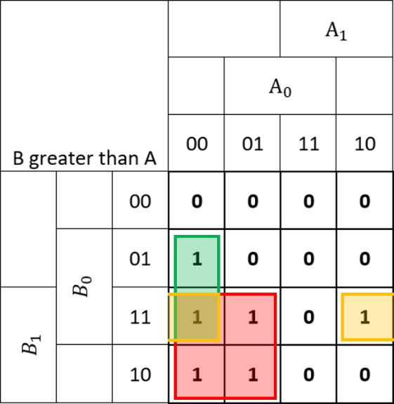
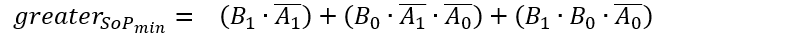
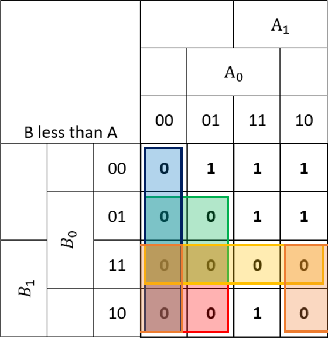
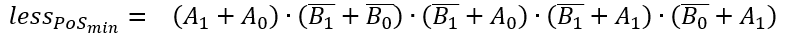
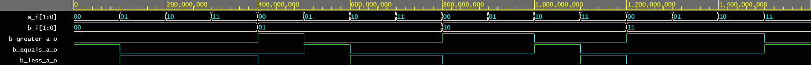
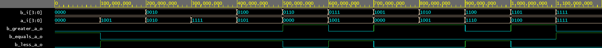
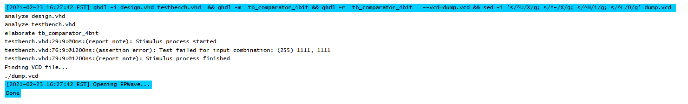

# Vypracovanie PC_2
Alexander Bekeč, 221096

Link to depository: https://github.com/alexander-bekec/Digital-electronics-1

## 1. Preparation task

| **Dec. equivalent** | **B[1:0]** | **A[1:0]** | **B is greater than A** | **B equals A** | **B is less than A** |
| :-: | :-: | :-: | :-: | :-: | :-: |
| 0 | 0 0 | 0 0 | 0 | 1 | 0 |
| 1 | 0 0 | 0 1 | 0 | 0 | 1 |
| 2 | 0 0 | 1 0 | 0 | 0 | 1 |
| 3 | 0 0 | 1 1 | 0 | 0 | 1 |
| 4 | 0 1 | 0 0 | 1 | 0 | 0 |
| 5 | 0 1 | 0 1 | 0 | 1 | 0 |
| 6 | 0 1 | 1 0 | 0 | 0 | 1 |
| 7 | 0 1 | 1 1 | 0 | 0 | 1 |
| 8 | 1 0 | 0 0 | 1 | 0 | 0 |
| 9 | 1 0 | 0 1 | 1 | 0 | 0 |
| 10 | 1 0 | 1 0 | 0 | 1 | 0 |
| 11 | 1 0 | 1 1 | 0 | 0 | 1 |
| 12 | 1 1 | 0 0 | 1 | 0 | 0 |
| 13 | 1 1 | 0 1 | 1 | 0 | 0 |
| 14 | 1 1 | 1 0 | 1 | 0 | 0 |
| 15 | 1 1 | 1 1 | 0 | 1 | 0 |



## 2. 2-bit comparator










https://www.edaplayground.com/x/MyMd



## 3. 4-bit comparator
https://www.edaplayground.com/x/wYGV

```VHDL
-- design.vhd
library IEEE;
use IEEE.std_logic_1164.all;

entity comparator_4bit is
    port(
        a_i           : in  std_logic_vector(4 - 1 downto 0);
        b_i           : in  std_logic_vector(4 - 1 downto 0);
        B_greater_A_o : out std_logic;
		B_equals_A_o  : out std_logic;
        B_less_A_o    : out std_logic
    );
end entity comparator_4bit;

architecture Behavioral of comparator_4bit is
begin
    B_less_A_o    <= '1' when (b_i < a_i) else '0';
	B_equals_A_o  <= '1' when (b_i = a_i) else '0';
    B_greater_A_o <= '1' when (b_i > a_i) else '0';
end architecture Behavioral;
```

```VHDL
-- testbench.vhd + error at 255
library IEEE;
use IEEE.std_logic_1164.all;

entity tb_comparator_4bit is

end entity tb_comparator_4bit;

architecture testbench of tb_comparator_4bit is

    signal s_a       : std_logic_vector(4 - 1 downto 0);
    signal s_b       : std_logic_vector(4 - 1 downto 0);
    signal s_B_greater_A : std_logic;
    signal s_B_equals_A  : std_logic;
    signal s_B_less_A    : std_logic;
    
begin
    uut_comparator_4bit : entity work.comparator_4bit
        port map(
            a_i           => s_a,
            b_i           => s_b,
            B_greater_A_o => s_B_greater_A,
            B_equals_A_o  => s_B_equals_A,
            B_less_A_o    => s_B_less_A
        );
        
    p_stimulus : process
    begin
        report "Stimulus process started" severity note;
        
        s_b <= "0000"; s_a <= "0000"; wait for 100 ns;
        assert ((s_B_greater_A = '0') and (s_B_equals_A = '1') and (s_B_less_A = '0'))
        report "Test failed for input combination: (0) 0000, 0000" severity error;
        
        s_b <= "0000"; s_a <= "1001"; wait for 100 ns;
        assert ((s_B_greater_A = '0') and (s_B_equals_A = '0') and (s_B_less_A = '1'))
        report "Test failed for input combination: (9) 0000, 1001" severity error;
        
        s_b <= "0010"; s_a <= "1010"; wait for 100 ns;
        assert ((s_B_greater_A = '0') and (s_B_equals_A = '0') and (s_B_less_A = '1'))
        report "Test failed for input combination: (42) 0010, 1010" severity error;
        
        s_b <= "0010"; s_a <= "1111"; wait for 100 ns;
        assert ((s_B_greater_A = '0') and (s_B_equals_A = '0') and (s_B_less_A = '1'))
        report "Test failed for input combination: (47) 0010, 1111" severity error;

        s_b <= "0100"; s_a <= "0101"; wait for 100 ns;
        assert ((s_B_greater_A = '0') and (s_B_equals_A = '0') and (s_B_less_A = '1'))
        report "Test failed for input combination: (69) 0100, 0101" severity error;
        
        s_b <= "0110"; s_a <= "0000"; wait for 100 ns;
        assert ((s_B_greater_A = '1') and (s_B_equals_A = '0') and (s_B_less_A = '0'))
        report "Test failed for input combination: (96) 0110, 0000" severity error;
        
        s_b <= "0111"; s_a <= "1001"; wait for 100 ns;
        assert ((s_B_greater_A = '0') and (s_B_equals_A = '0') and (s_B_less_A = '1'))
        report "Test failed for input combination: (121) 0111, 1001" severity error;
        
        s_b <= "1001"; s_a <= "0000"; wait for 100 ns;
        assert ((s_B_greater_A = '1') and (s_B_equals_A = '0') and (s_B_less_A = '0'))
        report "Test failed for input combination: (144) 1001, 0000" severity error;

        s_b <= "1010"; s_a <= "1001"; wait for 100 ns;
        assert ((s_B_greater_A = '1') and (s_B_equals_A = '0') and (s_B_less_A = '0'))
        report "Test failed for input combination: (169) 1010, 1001" severity error;
        
        s_b <= "1100"; s_a <= "1110"; wait for 100 ns;
        assert ((s_B_greater_A = '0') and (s_B_equals_A = '0') and (s_B_less_A = '1'))
        report "Test failed for input combination: (206) 1100, 1110" severity error;
        
        s_b <= "1101"; s_a <= "0100"; wait for 100 ns;
        assert ((s_B_greater_A = '1') and (s_B_equals_A = '0') and (s_B_less_A = '0'))
        report "Test failed for input combination: (212) 1101, 0100" severity error;
        
        s_b <= "1111"; s_a <= "1111"; wait for 100 ns;
        assert ((s_B_greater_A = '1') and (s_B_equals_A = '0') and (s_B_less_A = '0'))
        report "Test failed for input combination: (255) 1111, 1111" severity error;

        report "Stimulus process finished" severity note;
        wait;
    end process p_stimulus;

end architecture testbench;
```



Console output with error at 255
