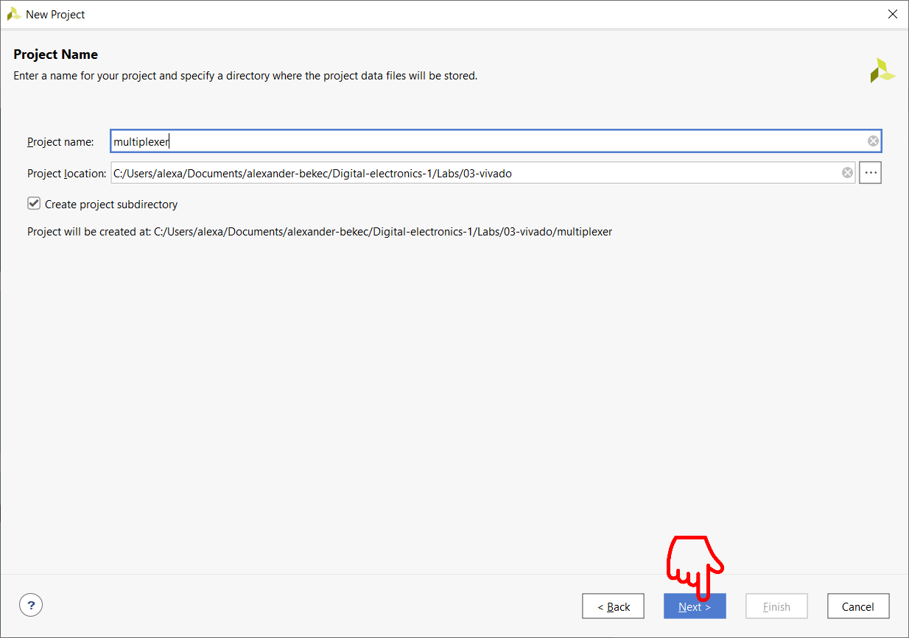
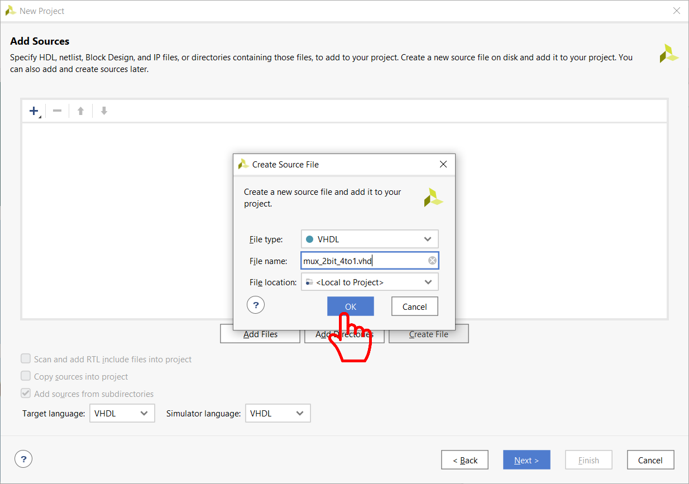

# Vypracovanie PC_3
Alexander Bekeč, 221096

Link to depository: https://github.com/alexander-bekec/Digital-electronics-1

## 1. Preparation task

| **Switch** | **Pin connection** | **LED** | **Pin connection** |
| :-: | :-: | :-: | :-: |
| SW0 | J15 | LED0 | H17 |
| SW1 | L16 | LED1 | K15 |
| SW2 | M13 | LED2 | J13 |
| SW3 | R15 | LED3 | N14 |
| SW4 | R17 | LED4 | R18 |
| SW5 | T18 | LED5 | V17 |
| SW6 | U18 | LED6 | U17 |
| SW7 | R13 | LED7 | U16 |
| SW8 | T8 | LED8 | V16 |
| SW9 | U8 | LED9 | T15 |
| SW10 | R16 | LED10 | U14 |
| SW11 | T13 | LED11 | T16 |
| SW12 | H6 | LED12 | V15 |
| SW13 | U12 | LED13 | V14 |
| SW14 | U11 | LED14 | V12 |
| SW15 | V10 | LED15 | V11 |

## 2. 2-bit 4-to-1 multiplexer

```VHDL
-- Architecture (Source file)
library IEEE;
use IEEE.std_logic_1164.all;

entity mux_2bit_4to1 is
    port(
        a_i           : in  std_logic_vector(2 - 1 downto 0);
        b_i           : in  std_logic_vector(2 - 1 downto 0);
        c_i           : in  std_logic_vector(2 - 1 downto 0);
        d_i           : in  std_logic_vector(2 - 1 downto 0);
        sel_i         : in  std_logic_vector(2 - 1 downto 0);
        f_o           : out std_logic_vector(2 - 1 downto 0)
    );
end entity mux_2bit_4to1;

architecture Behavioral of mux_2bit_4to1 is
begin
    f_o    <= a_i when (sel_i = "00") else
                b_i when (sel_i = "01") else
                c_i when (sel_i = "10") else
                d_i;
end architecture Behavioral;
```

```VHDL
-- Stimulus process (Testbench file)
library IEEE;
use IEEE.std_logic_1164.all;

entity tb_mux_2bit_4to1 is

end entity tb_mux_2bit_4to1;

architecture testbench of tb_mux_2bit_4to1 is

    signal s_a       : std_logic_vector(2 - 1 downto 0);
    signal s_b       : std_logic_vector(2 - 1 downto 0);
    signal s_c       : std_logic_vector(2 - 1 downto 0);
    signal s_d       : std_logic_vector(2 - 1 downto 0);
    signal s_sel     : std_logic_vector(2 - 1 downto 0);
    signal s_f       : std_logic_vector(2 - 1 downto 0);
    
begin
    uut_mux_2bit_4to1 : entity work.mux_2bit_4to1
        port map(
            a_i     => s_a,
            b_i     => s_b,
            c_i     => s_c,
            d_i     => s_d,
            sel_i   => s_sel,
            f_o     => s_f
        );
        
    p_stimulus : process
    begin
        report "Stimulus process started" severity note;
        
        s_d <= "11"; s_c <= "10"; s_b <= "01"; s_a <= "00"; 
        s_sel <= "00"; wait for 250 ns;
        
        s_d <= "11"; s_c <= "10"; s_b <= "01"; s_a <= "00"; 
        s_sel <= "01"; wait for 250 ns;
        
        s_d <= "11"; s_c <= "10"; s_b <= "01"; s_a <= "00"; 
        s_sel <= "10"; wait for 250 ns;
        
        s_d <= "11"; s_c <= "10"; s_b <= "01"; s_a <= "00"; 
        s_sel <= "11"; wait for 250 ns;
        
        report "Stimulus process finished" severity note;
        wait;
    end process p_stimulus;

end architecture testbench;
```


## 3. Vivado Tutoriál
### Vytvorenie projektu
V hlavnom menu programu klikneme v sekcii Quick Start na Create Project:

V nasledujúcom okne "Create a New Vivado Project" klikneme na Next >

Otvorí sa okno "Project Name", v ktorom definujeme názov projektu a adresu k miestu jeho uloženia. Po zadaní klikneme na Next >

V nasledujúcom okne "Project Type" klikneme na Next > (bez zmeny zaškrtávacích políčok)

V ďalšom okne "Add Sources" pridávame alebo vytvárame nový zdrojový súbor

Vytvorenie zdrojového súboru (Create File):


Pridanie existujúceho zdrojového súboru (Add Files):


Po vytvorení alebo pridaní súboru klikneme na Next >

To nás presunulo do okna "Add Constraints"

Vytvorenie súboru (Create File):


Pridanie existujúceho súboru (Add Files):


Kliknutie na Next > nás v oboch prípadoch presunie do okna s výberom súčiastky (Default Part)


Potvrdenie výberu stlačením Next > nás presunie do okna so zhrnutím nastavení projektu


### Pridanie súboru v rámci programu
Súbor v rámci projektu pridáme cez File > Add Sources... (Alt + A)

Add or Create Constrains (v ďalších oknách vedie rovnako ako pri vytváraní projektu):

Add or Create Design Sources (v ďalších oknách vedie rovnako ako pri vytváraní projektu):

Add or Create Simulation Sources (Testbench)


### Run Simulation


