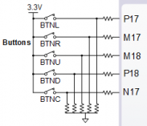
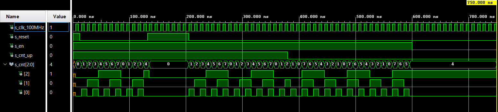
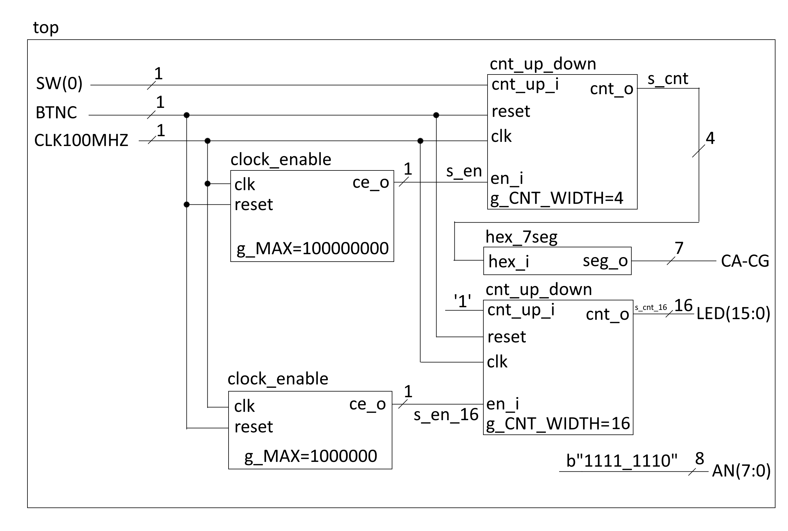

# Vypracovanie PC_5
Alexander Bekeč, 221096

Link to depository: https://github.com/alexander-bekec/Digital-electronics-1

## 1. Preparation task
### Push buttons


| **Button** | **Name** | **Pin connection** |
| :-: | :-: | :-: |
| Left Button | BTNL | P17 |
| Right Button | BTNR | M17 |
| Up Button | BTNU | M18 |
| Down Button | BTND | P18 |
| Central Button | BTNC | N17 |

When the buttons are at rest, they generate low output (0) and when they are pressed, they generate high output (1).

### Periods of clock signal

| **Time interval** | **Number of clk periods** | **Number of clk periods in hex** | **Number of clk periods in bin** |
   | :-: | :-: | :-: | :-: |
   | 2&nbsp;ms | 200 000 | `x"3_0d40"` | `b"0011_0000_1101_0100_0000"` |
   | 4&nbsp;ms | 400 000 | `x"6_1A80"` | `b"0110_0001_1010_1000_0000"` |
   | 10&nbsp;ms | 1 000 000 | `x"F_4240"` | `b"1111_0100_0010_0100_0000"` |
   | 250&nbsp;ms | 25 000 000 | `x"17D_7840"` | `b"0001_0111_1101_0111_1000_0100_0000"` |
   | 500&nbsp;ms | 50 000 000 | `x"2FA_F080"` | `b"0010_1111_1010_1111_0000_1000_0000"` |
   | 1&nbsp;sec | 100 000 000 | `x"5F5_E100"` | `b"0101_1111_0101_1110_0001_0000_0000"` |

## 2. Bidirectional counter

```VHDL
p_cnt_up_down : process(clk)                                       
begin                                                              
    if rising_edge(clk) then                                       
                                                                   
        if (reset = '1') then               
            s_cnt_local <= (others => '0'); 
                                                                   
        elsif (en_i = '1') then       
            if (cnt_up_i = '1') then
                s_cnt_local <= s_cnt_local + 1;                    
            else                                                   
                s_cnt_local <= s_cnt_local - 1;                    
            end if;                                                
        end if;                                                    
    end if;                                                        
end process p_cnt_up_down;
```

```VHDL
p_reset_gen : process   
begin                   
    s_reset <= '1';     
    wait for 12 ns;     
                        
    s_reset <= '0';     
    wait for 120 ns;    
                        
    s_reset <= '1';     
    wait for 73 ns;     
                        
    s_reset <= '0';     
    wait;               
end process p_reset_gen;
```

```VHDL
p_stimulus : process                                 
begin                                                
    report "Stimulus process started" severity note; 
                                                     
    -- Enable counting                               
    s_en     <= '1';                                 
                                                     
    -- Change counter direction                      
    s_cnt_up <= '1';                                 
    wait for 380 ns;                                 
    s_cnt_up <= '0';                                 
    wait for 220 ns;                                 
                                                     
    -- Disable counting                              
    s_en     <= '0';                                 
                                                     
    report "Stimulus process finished" severity note;
    wait;                                            
end process p_stimulus;                              
```



## 3. Top level

```VHDL
clk_en0 : entity work.clock_enable -- Instance (copy) of clock_enable entit
    generic map(                                                           
        g_MAX => 100000000                                                 
    )                                                                      
    port map(                                                              
        clk => CLK100MHZ,                                                  
        reset => BTNC,                                                     
        ce_o => s_en                                                       
    );                                                                     
                                                                           
bin_cnt0 : entity work.cnt_up_down -- Instance (copy) of cnt_up_down entity
    generic map(                                                           
        g_CNT_WIDTH => 4                                                   
    )                                                                      
    port map(                                                              
        clk => CLK100MHZ,                                                  
        reset => BTNC,                                                     
        en_i => s_en,                                                      
        cnt_up_i => SW(0),                                                 
        cnt_o => s_cnt                                                     
    );                                                                     
                                                                           
LED(3 downto 0) <= s_cnt; -- Display input value on LEDs                   
                                                                           
hex2seg : entity work.hex_7seg -- Instance (copy) of hex_7seg entity       
    port map(                                                              
        hex_i    => s_cnt,                                                 
        seg_o(6) => CA,                                                    
        seg_o(5) => CB,                                                    
        seg_o(4) => CC,                                                    
        seg_o(3) => CD,                                                    
        seg_o(2) => CE,                                                    
        seg_o(1) => CF,                                                    
        seg_o(0) => CG                                                     
    );                                                                     
                                                                           
AN <= b"1111_1110"; -- Connect one common anode to 3.3V
```

