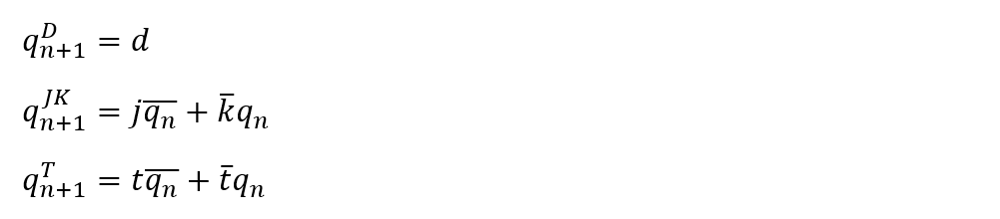
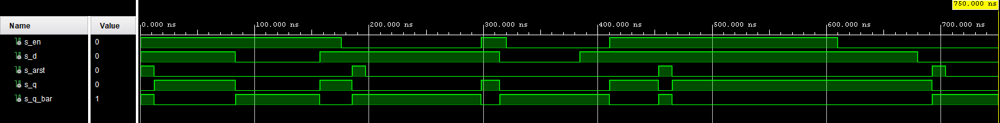
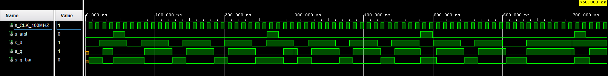
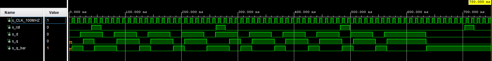
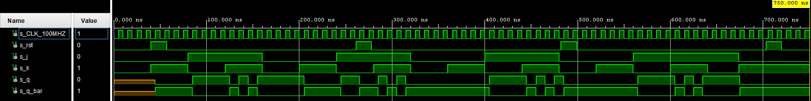
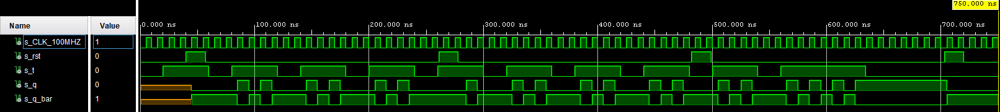
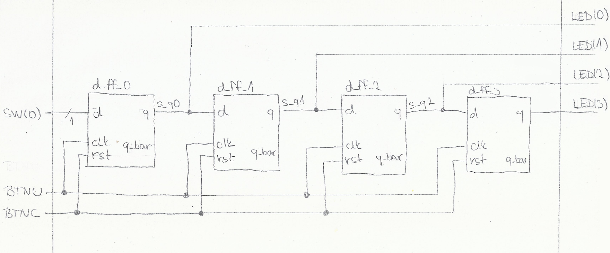

# Vypracovanie PC_7
Alexander Bekeč, 221096

Link to depository: https://github.com/alexander-bekec/Digital-electronics-1

## 1. Preparation task


| **clk** | **d** | **q(n)** | **q(n+1)** | **Comments** |
| :-: | :-: | :-: | :-: | :-- |
| ↑ | 0 | 0 | 0 | Indepedent of q(n) |
| ↑ | 0 | 1 | 0 | Indepedent of q(n) |
| ↑ | 1 | 0 | 1 | Indepedent of q(n) |
| ↑ | 1 | 1 | 1 | Indepedent of q(n) |

| **clk** | **j** | **k** | **q(n)** | **q(n+1)** | **Comments** |
| :-: | :-: | :-: | :-: | :-: | :-- |
| ↑ | 0 | 0 | 0 | 0 | No change |
| ↑ | 0 | 0 | 1 | 1 | No change |
| ↑ | 0 | 1 | 0 | 0 | Reset |
| ↑ | 0 | 1 | 1 | 0 | Reset |
| ↑ | 1 | 0 | 0 | 1 | Set |
| ↑ | 1 | 0 | 1 | 1 | Set |
| ↑ | 1 | 1 | 0 | 1 | Invert |
| ↑ | 1 | 1 | 1 | 0 | Invert |

| **clk** | **t** | **q(n)** | **q(n+1)** | **Comments** |
| :-: | :-: | :-: | :-: | :-- |
| ↑ | 0 | 0 | 0 | No change |
| ↑ | 0 | 1 | 1 | No change |
| ↑ | 1 | 0 | 1 | Invert |
| ↑ | 1 | 1 | 0 | Invert |

## 2. D latch
```VHDL
p_d_latch : process (en, arst, d)
begin                            
    if (arst = '1') then         
        s_q <= '0';              
    elsif (en = '1') then        
        s_q <= d;                
    end if;                      
end process p_d_latch;           
q <= s_q;                        
q_bar <= not s_q;                          
```

```VHDL
p_arst : process
begin                                                                                                 
    report "start of p_arst" severity note;                                                           
    s_arst <= '1';                                                                                    
    wait for 10 ns;                                                                                   
    assert (s_q='0' and s_q_bar='1') report "error at time 10 ns at p_arst" severity error;           
    wait for 2 ns;                                                                                    
    s_arst <= '0';                                                                                    
    wait for 173 ns;                                                                                  
    s_arst <= '1';                                                                                    
    wait for 12 ns;                                                                                   
    s_arst <= '0';                                                                                    
    wait for 256 ns;                                                                                  
    s_arst <= '1';                                                                                    
    wait for 12 ns;                                                                                   
    s_arst <= '0';                                                                                    
    wait for 227 ns;                                                                                  
    s_arst <= '1';                                                                                    
    wait for 12 ns;                                                                                   
    s_arst <= '0';                                                                                    
    wait;                                                                                             
end process p_arst;                                                                                   
                                                                                                      
p_en : process                                                                                        
begin                                                                                                 
    report "start of p_en" severity note;                                                             
    s_en <= '1';                                                                                      
    wait for 176 ns;                                                                                  
    s_en <= '0';                                                                                      
    wait for 122 ns;                                                                                  
    s_en <= '1';                                                                                      
    wait for 22 ns;                                                                                   
    s_en <= '0';                                                                                      
    wait for 90 ns;                                                                                   
    s_en <= '1';                                                                                      
    wait for 10 ns;                                                                                   
    assert (s_q='1' and s_q_bar='0') report "error at time 420 ns at p_en" severity error;            
    wait for 190 ns;                                                                                  
    s_en <= '0';                                                                                      
    wait;                                                                                             
end process p_en;                                                                                     
                                                                                                      
p_stimulus : process                                                                                  
begin                                                                                                 
    report "start of p_stimulus" severity note;                                                       
    s_d <= '1';                                                                                       
    wait for 83 ns;                                                                                   
    s_d <= '0';                                                                                       
    wait for 74 ns;                                                                                   
    s_d <= '1';                                                                                       
    wait for 157 ns;                                                                                  
    s_d <= '0';                                                                                       
    wait for 70 ns;                                                                                   
    s_d <= '1';                                                                                       
    wait for 296 ns;                                                                                  
    s_d <= '0';                                                                                       
    wait;                                                                                             
end process p_stimulus;                                                                               
```



## 3. Flip-flops
### Clock process (common for all four flip-flops)
```VHDL
p_clk_gen : process                      
begin                                    
    while now < 750 ns loop              
        s_CLK_100MHZ <= '0';             
        wait for c_CLK_100MHZ_PERIOD / 2;
        s_CLK_100MHZ <= '1';             
        wait for c_CLK_100MHZ_PERIOD / 2;
    end loop;                            
    wait;                                
end process p_clk_gen;                   
```

### D flip-flop with asynchronous reset
```VHDL
p_d_ff_arst : process (clk, arst)
begin                            
    if (arst = '1') then         
        s_q <= '0';              
    elsif rising_edge(clk) then  
        s_q <= d;                
    end if;                      
end process p_d_ff_arst;         
q <= s_q;                        
q_bar <= not s_q;                
```

```VHDL
p_reset_gen : process                                                         
begin                                                                         
    report "Start of reset generation process" severity note;                 
                                                                              
    while now < 750 ns loop                                                   
        s_arst <= '0';                                                        
        wait for 40 ns;                                                       
        s_arst <= '1';                                                        
        wait for 17 ns;                                                       
        s_arst <= '0';                                                        
        wait for 164 ns;                                                      
    end loop;                                                                 
    wait;                                                                     
                                                                              
    report "End of reset generation process" severity note;                   
end process p_reset_gen;
```

```VHDL                                                                              
p_stimulus : process                                                          
begin                                                                         
    report "Start of stimulus process" severity note;                         
                                                                              
    while now < 600 ns loop                                                   
        s_d <= '0';                                                           
        wait for 20 ns;                                                       
        s_d <= '1';                                                           
        wait for 40 ns;                                                       
    end loop;                                                                 
    s_d <= '0';                                                               
    wait for 10 ns;                                                           
    assert (s_q = '0' and s_q_bar = '1') report "assert error" severity error;
    wait for 24 ns;                                                           
    s_d <= '1';                                                               
    wait for 10 ns;                                                           
    assert (s_q = '1' and s_q_bar = '0') report "assert error" severity error;
    wait;                                                                     
                                                                              
    report "End of stimulus process" severity note;                           
end process p_stimulus;                                                       
```



### D flip-flop with synchronous reset
```VHDL
p_d_ff_rst : process (clk)  
begin                       
    if rising_edge(clk) then
        if (rst = '1') then 
            s_q <= '0';     
        else                
            s_q <= d;       
        end if;             
    end if;                 
end process p_d_ff_rst;     
q <= s_q;                   
q_bar <= not s_q;           
```

```VHDL
p_reset_gen : process                                                          
begin                                                                          
    report "Start of reset generation process" severity note;                  
                                                                               
    while now < 750 ns loop                                                    
        s_rst <= '0';                                                          
        wait for 40 ns;                                                        
        s_rst <= '1';                                                          
        wait for 17 ns;                                                        
        s_rst <= '0';                                                          
        wait for 164 ns;                                                       
    end loop;                                                                  
    wait;                                                                      
                                                                               
    report "End of reset generation process" severity note;                    
end process p_reset_gen;                                                       
```

```VHDL                                                                               
p_stimulus : process                                                           
begin                                                                          
    report "Start of stimulus process" severity note;                          
                                                                               
    while now < 600 ns loop                                                    
        s_d <= '0';                                                            
        wait for 20 ns;                                                        
        s_d <= '1';                                                            
        wait for 40 ns;                                                        
    end loop;                                                                  
    s_d <= '1';                                                                
    wait for 10 ns;                                                            
    assert (s_q = '1' and s_q_bar = '0') report "assert error" severity error; 
    wait for 24 ns;                                                            
    s_d <= '0';                                                                
    wait for 10 ns;                                                            
    assert (s_q = '0' and s_q_bar = '1') report "assert error" severity error; 
    wait;                                                                      
                                                                               
    report "End of stimulus process" severity note;                            
end process p_stimulus;                                                        
```



### JK flip-flop with synchronous reset
```VHDL
p_jk_ff_rst : process (clk)                           
begin                                                 
    if rising_edge(clk) then                          
        if (rst = '1') then                           
            s_q <= '0';                               
        else                                          
            s_q <= (j and not s_q) or (not k and s_q);
        end if;                                       
    end if;                                           
end process p_jk_ff_rst;                              
q <= s_q;                                             
q_bar <= not s_q;                                     
```

```VHDL
p_reset_gen : process                                                            
begin                                                                            
    report "Start of reset generation process" severity note;                    
                                                                                 
    while now < 750 ns loop                                                      
        s_rst <= '0';                                                            
        wait for 40 ns;                                                          
        s_rst <= '1';                                                            
        wait for 17 ns;                                                          
        s_rst <= '0';                                                            
        wait for 164 ns;                                                         
    end loop;                                                                    
    wait;                                                                        
                                                                                 
    report "End of reset generation process" severity note;                      
end process p_reset_gen;
```

```VHDL                                                                                 
p_stimulus : process                                                             
begin                                                                            
    report "Start of stimulus process" severity note;                            
                                                                                 
    while now < 600 ns loop                                                      
        s_j <= '0';                                                              
        s_k <= '0';                                                              
        wait for 40 ns;                                                          
        s_j <= '0';                                                              
        s_k <= '1';                                                              
        wait for 40 ns;                                                          
        s_j <= '1';                                                              
        s_k <= '0';                                                              
        wait for 40 ns;                                                          
        s_j <= '1';                                                              
        s_k <= '1';                                                              
        wait for 40 ns;                                                          
    end loop;                                                                    
    s_j <= '1';                                                                  
    s_k <= '0';                                                                  
    wait for 10 ns;                                                              
    assert (s_q = '1' and s_q_bar = '0') report "assert error" severity error;   
    wait for 24 ns;                                                              
    s_j <= '0';                                                                  
    s_k <= '1';                                                                  
    wait for 10 ns;                                                              
    assert (s_q = '0' and s_q_bar = '1') report "assert error" severity error;   
    wait;                                                                        
                                                                                 
    report "End of stimulus process" severity note;                              
end process p_stimulus;                                                          
```



### T flip-flop with synchrnous reset
```VHDL
p_t_ff_rst : process (clk)                            
begin                                                 
    if rising_edge(clk) then                          
        if (rst = '1') then                           
            s_q <= '0';                               
        else                                          
            s_q <= (t and not s_q) or (not t and s_q);
        end if;                                       
    end if;                                           
end process p_t_ff_rst;                               
q <= s_q;                                             
q_bar <= not s_q;                                     
```

```VHDL
p_reset_gen : process                                                                
begin                                                                                
    report "Start of reset generation process" severity note;                        
                                                                                     
    while now < 750 ns loop                                                          
        s_rst <= '0';                                                                
        wait for 40 ns;                                                              
        s_rst <= '1';                                                                
        wait for 17 ns;                                                              
        s_rst <= '0';                                                                
        wait for 164 ns;                                                             
    end loop;                                                                        
    wait;                                                                            
                                                                                     
    report "End of reset generation process" severity note;                          
end process p_reset_gen;
```

```VHDL                                                                                     
p_stimulus : process                                                                 
begin                                                                                
    report "Start of stimulus process" severity note;                                
                                                                                     
    while now < 600 ns loop                                                          
        s_t <= '0';                                                                  
        wait for 20 ns;                                                              
        s_t <= '1';                                                                  
        wait for 40 ns;                                                              
    end loop;                                                                        
    s_t <= '1';                                                                      
    wait for 10 ns;                                                                  
    assert (s_q = '0' and s_q_bar = '1') report "assert error" severity error;       
    wait for 24 ns;                                                                  
    s_t <= '0';                                                                      
    wait for 10 ns;                                                                  
    assert (s_q = '1' and s_q_bar = '0') report "assert error" severity error;       
    wait;                                                                            
                                                                                     
    report "End of stimulus process" severity note;                                  
end process p_stimulus;                                                              
```



## 4. Shift register
